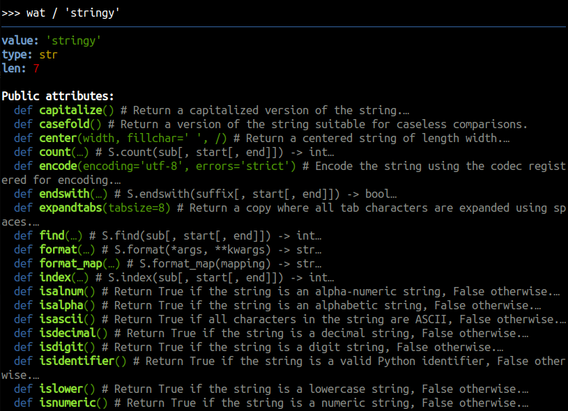
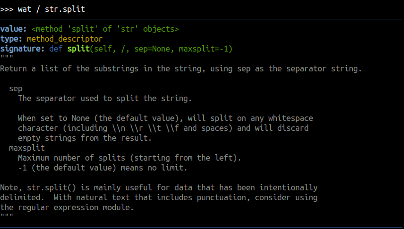
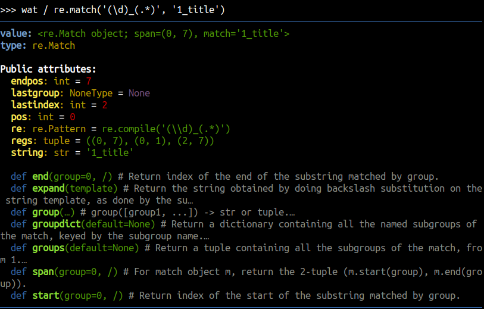
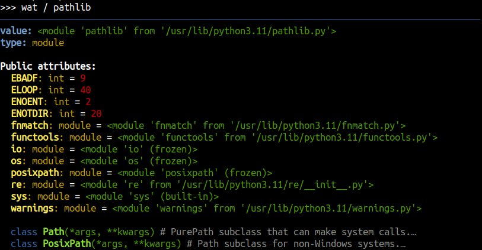
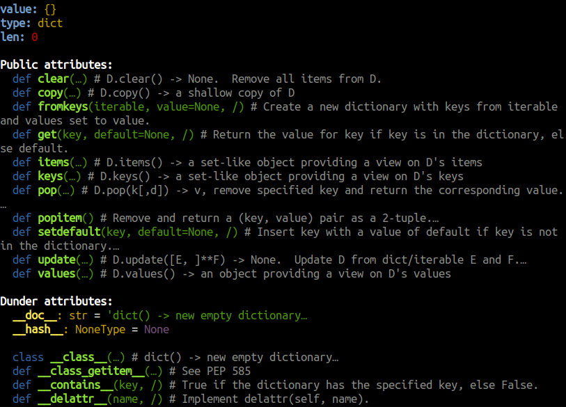
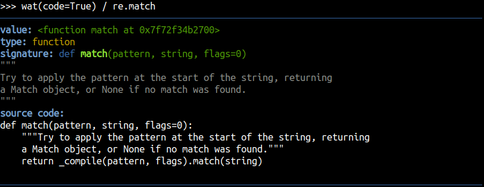

# Nuclear Inspect

**Nuclear** comes with a powerful inspection tool
that allows you to delve into and examine unknown objects at runtime.

## WAT inspector
> "Wat" is a variant of the English word "what" that is often used to express confusion or disgust

If you are deep down in the Python console, dazed and confused, and you're like "WAT? What's that thing?", that's where `wat` inspector comes in handy.

Nuclear comes with the `wat` object that can quickly inspect things by using the division operator (to avoid typing parentheses). 

Start the Python Interpreter (or attach to your program) and execute `wat / object` on any `object` to investigate
its **type**, **formatted value**, **attributes**, **methods**, **parent types**, **signature**, **documentation**, and even **source code**.

<video width="100%" src="https://raw.githubusercontent.com/igrek51/nuclear/master/docs/demo/demo-inspect.mp4" controls="true" allowfullscreen="true" poster="https://raw.githubusercontent.com/igrek51/nuclear/master/docs/demo/demo-inspect-poster.png"></video>

## Import
Import inspection tools from **nuclear** package.
```sh
pip install nuclear
```
```python
from nuclear import inspect, wat, wats
```

Alternatively, use **Insta-Load** in the section below.

### Insta-Load
If you want to debug something quickly, you don't even need to install **nuclear** package to use `wat` inspector.

Load it on the fly by pasting this snippet to your Python interpreter:
```python
import base64, zlib
code = 'eJzNGu1u20byf55i4f4QlTCq3dwHoEa5cxs3DZAmh8S9ILANlpJWNhuKFLhUEkcnoA9xz3APdk9yM7Nfs/yQ5Fx/NEBkcne+d3Z2ZriLqlyKeVqnszxVSiqRLVdlVfuhe2YgK9RKzmqRKqHqeWJe7Wzp4Cppn9SturdA8vXtKiuuLeXT4jYWT7NZHYsXmYLfV6s6K4s0j8X57UrG4nktq3Saw9PPBUzc+7uXhX7Fc837+7JYZNfjewL+qRsgPRbTsszpfb4u5rLiA+VMsde8LK7Z66ycS/Pax+20rqtsuq6lZlikS8BQdUVvH9J8Da+gGr2CwvCG2mjqaZ6jQrvkW1XZh7TmICq7LtJ6XcGYtdAF8Luy6jSH53JhFykimHL6K4kU09v9uGkoMRE/pLmScUuixowzHYyfV2sz7E0YgntbhuNghObwUNvy6OiI/p59SpdZIUV9I1F4UGQA/lgsymqZoqaxUOvZDXpgVisyciz0ZC3neg1i+FNlaGwVi6Wsb8q5clqsl7KoiZIoK6HKdTWTJO6IIMartEqX2myavahLa1IOYWz48QboywqBYPWKWo+Lcl2v1rX4mAFz+Jtav1EiKmRGGE5GUYAgRswhZ2FXo8VDTzCqARatVBsnUB0sJhbrYoYvSqTFXJitzynpxW1RKsriYTqdVvJDljqbayIBE05K+0PbWN78olyI1Mlk1w3XSO9DRoyciNHKilm+Bgowzj0lcCviF5l1TDSM3iFml8R65Sb0GxsTT4ylQQogHpNFJvjjRtDaE/xxI6jMRGtEI8RkOORbM+D/B9qhQ/HwCYazsYHA0AqzQaiN+s3ErMFMxSyivVvvjTEFfopawOJCRzR4S8idYMgYSb9HYCWNXcmVgaHIC4A44uezBQMRkwkC0SwuRziTwFS2SmZlXlaRY23ikZd0lK5WsphHi8Hmzfm7F2fJd6+fP/vxPPnuxc9nWy3J5vXZm7Pzrdg4KtuBFkeCYe9EEM3fT+5AIqinp8Lntxtvg62BMLSRGcZTZnt8jegHLciXbyd7OvoCJXDE8oFNDCFCMTZ6hIBUsJIG9E4GtDiOvxmw7IFspmAj1mkxI71iEeWUg8wpHwFxYzG9rfHwwD9pVaWQrNTrFWYjSgIIJDSfZUGPVVpcy+HdfCaXhZcudHOY0qZm0trMgSY8I0w+wIbXssZzQCsySBIcTpIBPP/3t/8wr3GZBNodkBJLNnEzEeLGwi3AoR7rchS/5HbIqgExwfKFRy0sRQgMVE5ThKKziCLNiMIqvXdbQGOMZuUaQvvgshgMcVcfe4AdCjx7ffpuC4fDBijQ32ArtHcuIyU/1UjqokVrQAEQ3GPACF75ddRa0dGAWkUshR5lio45F6kClZnO5sQ0ttRvCZKMgmUDdnruIGMEq+mPZLuel8VGjzKnLMraKqTPKseH5ToQfGFKzqMkg3Q+8TPaATT+MBbv5e0kT5fTeUrYY/odoTe2HNEYP4EtPTckVaIkJQ2RZ+CIO4GhEBmBwYEM2BoAb6PhWIivBAiffS4hZcnFNK0cO5AX0tA0Tz5m8/oGNCnVCC3uxlX2WUZDWM18vSxUU0xYVlnV0XEsjIXBtOIB7Ml//zYQ95vUHwgydN+uuzOJGqwEIuOWGP1aZgXEN8ioMeejh6yw+SnYRY8oWtCXZSGDFe4yGjMRcQlOURyz5zTs/4KAKPXpcgGd95ilGod5BuUitgq8aNZfV1oMcBz0snnGEgBUE8ZRS5z28ppcboLDoFVa1Qrz8wiCJkQO3JE4AQZnw0GsMVk3ADLvNwlZsM1gqs6KtXSDprDr4m1YI0VNyiG5RAj9zhnO50O0b7yELp4DioseOqO50yEARGPNe8hPn4QCIrmIt2gY1U3xRXHdWAef95K5zWQ+b5XYUWBSDAYTFC0YJY4TzTeYwFRiQomL1iSctcJMnFThfJjVBlNmJSfmbzjpjDhxTw3C5QzTYz+oy4K+FTb7A9SmXJe2BIxoZ6urW+91ZrcFyYDzDvlpJle1cJY9qyosTZSQLQLSy9OTH4x1gmSlI5mCHkSHdAn3O8zH+cnnyfsc00gc/RMtQeLqvhA9DnsIH0WQ8QyPXMDvOV3HbFfKRfYJMXWT58hk7G3ksoIQCIHSlqe9hFJ1W8wE2rCX2F4aO7F1WfxluNN1loMWhyLfpKors9yLytMmD3HETwWfeWDKsdFQ2zAbefb67OzldoNcty7RoiG/6q6C8W7bSIkOd1IjGjcZ0NPk/OliPfPVm6ZbxhDB5rb30XRUQ5zCnhPVZMJml/tCvU9cHW4bAhoiQQ4Nxzly6mbvKWHyTId35LBJiCYawHUsrZlMKP2TBaUBxXUEwCaosRQtsc2uSOd3zVi/Kwdw/QgKi4mu+W3VRMxNwKSkse8M0usNa9UgQGcEYeLTMHRSEdbOybuzFy9evd1uXHpqHdNMjMXGstgCj42T2DooN4nZyd0GCTU32Rix9dVWcyVIXi8aRcOBxadxbBjzjMYO7imhWvT9/hO8BPrKTGNJ5TamJdIup3aQHUPJEdZWMOBoXxasvur3zC7CZh06vMd371tbcacHMuzdu8ghcx9r7h4HNAwEbYuYUawZC+yiwoK1/IW1OMyWQKJtGx0FoXWwMd0mY113mOpctC+uuHD+0+mzs5fnp1uEChaIk8CSv59EEP0RtJcONS33Enp99nRLkE06bQtFYEyo3vMyrYcdprKEkeImbKD108SeUpuWXVec5Ytr13Wi/zw46WpZ2RCXqR2UcfYAyt1ugC0749Jb5wncH5nc8Dg2X/KYT4b+iDWm6mz4Zv7IxIIVh7C41cO8nIvtuhdo0hEUk0vFi1EA6dyYhKrJ+TJozz5uI5ACrG3CxN5uDGuM/j7gx75VorX3NdgSEutEU8DECMeOQOdIDz088WyX2XwOCTgRaNXzatjrofac2vgGDidFDR0mReMU224Pia1NVttGLtb2w3xsvvV+gZ+gFzgHyMe/00o2/E08QL3+WGt48UVLeHX3Fby46lw/9wUg0d+ywwVblvN1jrUXQYySRA8kibWbATAHBzY2LQoVgoBBpVfCcaktR7XKQ1js2n5A3+V9lr0uUUL/7cPR7LajXmSXpwefJ5q2cC0qn6ez2omgqXqapkqqsHxCp8Zh/dXF6IqSGNgwXQKqHhjMp79OhzD4r9V8wn+6xRIsqiMWphrNbzG+gHKrbiyK3xi0K3dbSdfzhnojz8G2oO9pOMqLrFI1eXgswGyVVLi9EHgE5OuM6mZKU62hEYRZ1OEDGnt5oL+GuN0si8jPDsUTcXJ8vJfKxRigrgJa1rc4J3KfVrrf1aQ2ka7V2zyoI+rdbbWe5tlMc8GIiQ/kW/QAbsU68rySsE1J237U+TX1vHTQNQAHU+ZUzQ2VtTfAoQQCCbRqUD12oweqc91s8ypUpJ9OoGk/IaNPL51A3x3yaLHNnY+DNNuh1U4yTcX6ldpFpqlXBxX8WstWC5BDLf320rHINIT8gMtBzYfqfxA685BxUJTYANowGDIfd4W+3m6E+1TEK2OuCu6PPl069ekQawdiX1PAfwTn3ot2Ddf97oa1+/5QyzL+v4dpuTpk2z599ht3P+Ze6wafcfQlJubsdzbu0+bVrN22ZQHldzAtD09Mk7sbdj9iv111L/1tWrt7feYUK5G0rmHx1pY0F/3Wxfui/FiYfEbRnTmo8T5AxYt39FZw3gGqvcdF5yokvVmdJJGS+SIW9++//5hW14p/JYeJUUK3xTCg6XmGT3dgNH6YgDBkvDCW3Mjcdkfxn818BowWXm/pI2XhHxfrWS7TCs0ivDm0yk8YNcaVKLa+ti7QEOfVrfglTGc/AuGvDUHjcb/EHUDR/fsldZbVsAWPwaUDQwOhnS2mQ/BXI8HfRIga0B6Zfjb4pe5cBv0GfaVsTwMImd1kcx63ROQvUaK/s0uUAX3zPe8ABv33K0OCeM9td5/JiXv4xcuABXWwD5b4DncyAy50Ne9gLne6rhnwgVThEDZ9NznB6YMvFSbe7b2iwDZOzzUF/Kfvhvoxk7unszqhj/Q6zJR43dRXQ2Ej1N65JiDcKjwCMar0VdVHLgxLpqFro5jnQBffLwYQMqDSQnZXYfMegcMK0QhBZFlc3N+Df0uBgYNraWtYHgjFTmBmg7H7YEaaMnMR0BBq+K8ZpVzdZIv6iwgBpcePefD+v0g9ecJIldWXkvkX1+3L9bqHcXtC9h/iszIvOiLqy3G6fm54b0fxbNhVcqTW06gaXH46mV5eXM4fRN/Cz/BvSyzY4b92dNp0YjK4PH706OJ4ObjHdyc1qnDixE08ff6TG/3GjULUc6PH3z46adAJ5k/4PG1/jvpNEzWEOOEQ+oTh2I+a2A2QkwAEb1Ix5D81kQOAEw5gPnBw7D+7ye/fnQYq/cXNvP3x+XnA8q/MEKfvvGFp5n94gm/k'
exec(zlib.decompress(base64.b64decode(code.encode())).decode(), globals())
```

Now you can use `wat`, `wats` or `inspect`.

## Options & aliases
You can call `wat(**options) / object` with the following `options`:

- `short=True` to hide attributes (variables and methods)
- `dunder=True` to display dunder attributes
- `docs=False` to hide documentation for functions and classes
- `long=True` to show non-abbreviated values and documentation
- `code=True` to reveal the source code of a function, method, or class
- `all=True` to include all available information

Type `wat` in the interpreter to learn more about this object itself.

You can also use `wats` alias or `inspect` function:
```python
from nuclear import wat, wats, inspect
obj = {None}
wat / obj  # Default ouput: value + type + public attributes
wats / obj  # Short output: value + type. Equivalent to: wat(short=True) / obj
inspect(obj)  # Same, but functional. Equivalent to: wat / obj
inspect(obj, **options)  # Equivalent to: wat(**options) / obj
wat(all=True) / obj  # Display all information, including dunder attributes, docs, code
```

## Use cases

### Determine type
In a dynamic typing language like Python, it's often hard to determine the type of an object. WAT Inspector can help you with that by showing the name of the type with the module it comes from.

```python
>>> wats / {None}
value: {None}
type: set
len: 1
```

### Look up methods
Listing methods, functions and looking up their signature is extremely beneficial to see how to use them.
Plus, you can read their docstrings.

```python
wat / 'stringy'
```



## Discover function's signature
See the docstrings and the signature of a function or a method to see how to use it.

```python
wat / str.split
```



### Look up variables
Check what's inside, list the value of variables and their types to see what's really inside the inspected object.
```python
wat / re.match('(\d)_(.*)', '1_title')
```



### Explore modules
One of the use cases is to explore modules.
For instance you can list functions, classes and the sub-modules of a selected module.

```python
import pathlib
wat / pathlib
```



Then, you can navigate further, e.g. `wat / pathlib.fnmatch`.

### Explore dunder attributes
```python
wat(dunder=True) / {}
```



### Review the code
Look up the source code of a function to see how it really works.

```python
import re
wat(code=True) / re.match
```



### Debug with breakpoint
You can use Python's `breakpoint()` keyword to launch an interactive debugger in your program:

```python
logger.debug('init')
x = {'what is it?'}
breakpoint()
logger.debug('done')
```

```python
(Pdb) from nuclear import wat  # or paste insta-load snippet
(Pdb) wat / x  # inspect local variable
...
(Pdb) c  # continue execution
```
